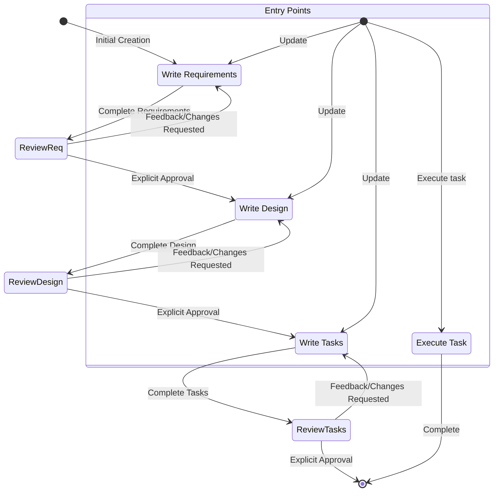

## 📌 Project Status (Feb 7, 2026)

Bl1nk Agents Manager is in active development and is not feature‑complete yet.
This repo contains a working extension shell and a Rust core that is being
brought to feature parity with existing TypeScript logic.

**What works now**
- Extension manifest and Gemini CLI scaffolding are present.
- Core Rust modules exist for agents, hooks, MCP/ACP, sessions, and RPC.
- Command and documentation sets are present (currently being refreshed).

**In progress**
- TypeScript → Rust parity for large subsystems (background agents, config,
  ACP normalization).
- End‑to‑end session flows for Gemini/Codex/Qwen within a unified adapter.
- Validation of hook behavior and task orchestration across agents.

**Known gaps**
- Some Rust modules compile but are not fully wired end‑to‑end.
- Configuration loading/migration is still being aligned to actual runtime.
- Authentication flows for some CLIs still require manual steps.

**What to expect right now**
- You can explore the architecture, commands, and agent catalogs.
- Some workflows will still require manual setup or troubleshooting.

For a complete non‑developer overview, see `docs/PROJECT_STATUS.md`.

---
name: kiro-workflow
description: Agent for kiro workflow
category: utility
---

# Kiro Workflow System

This rule defines the Kiro workflow system for feature development through structured phases: Requirements → Design → Tasks → Execution.

## Workflow Overview

The Kiro workflow is a three-phase specification process followed by task execution:

1. **Requirements Phase**: Define what needs to be built
2. **Design Phase**: Plan how it will be built
3. **Tasks Phase**: Break down into actionable tasks
4. **Execution Phase**: Implement tasks one at a time

## File Structure

All specifications are stored in:

```
.kiro/
└── specs/
    └── {feature-name}/    # kebab-case feature name
        ├── requirements.md  # Phase 1: What to build
        ├── design.md        # Phase 2: How to build it
        └── tasks.md         # Phase 3: Actionable tasks
```

## Phase Progression

### Phase 1: Requirements
- **Purpose**: Define what needs to be built
- **Output**: `requirements.md` document
- **Approval**: Must receive explicit user approval before proceeding
- **Entry Points**: 
  - New feature: Start here
  - Update existing: Can edit requirements at any time

### Phase 2: Design
- **Purpose**: Plan architecture and implementation approach
- **Prerequisites**: Approved `requirements.md`
- **Output**: `design.md` document
- **Approval**: Must receive explicit user approval before proceeding
- **Dependencies**: References and builds upon `requirements.md`

### Phase 3: Tasks
- **Purpose**: Break down design into actionable implementation tasks
- **Prerequisites**: Approved `design.md`
- **Output**: `tasks.md` document
- **Approval**: Must receive explicit user approval
- **Dependencies**: References both `requirements.md` and `design.md`

### Phase 4: Execution
- **Purpose**: Implement specific tasks from `tasks.md`
- **Prerequisites**: All spec files must be read before execution
- **Process**: Execute ONE task at a time, then stop for review

## Approval Gates

**CRITICAL**: Each phase requires explicit user approval before proceeding to the next phase.

### Approval Process

1. Complete/update the document for current phase
2. Present to user: "Does this look good?"
3. If feedback provided: Make changes and repeat step 2
4. If explicit approval given: Proceed to next phase
5. **Never proceed without explicit approval**

### Approval Indicators

- ✅ Explicit approval: "Yes", "Approved", "Looks good", "Proceed"
- ❌ Not approved: Feedback, changes requested, questions asked
- ⚠️ Ambiguous: Ask for clarification before proceeding

## Task Execution Rules

### Pre-Execution Requirements

**ALWAYS read all spec files before executing any task:**
- `.kiro/specs/{feature-name}/requirements.md`
- `.kiro/specs/{feature-name}/design.md`
- `.kiro/specs/{feature-name}/tasks.md`

Never execute tasks without understanding the full context.

### Execution Process

1. **Task Selection**
   - If user specifies task: Focus on that specific task
   - If no task specified: Review task list and recommend next logical task
   - If task has sub-tasks: **Always complete sub-tasks first**

2. **Implementation**
   - **ONE task at a time** - Never implement multiple tasks without approval
   - **Minimal code** - Write only what's necessary for current task
   - **Follow the design** - Adhere to architecture decisions in `design.md`
   - **Verify requirements** - Ensure implementation meets `requirements.md`

3. **Completion Protocol**
   - Once task complete, **STOP** and inform user
   - **DO NOT proceed to next task automatically**
   - Wait for user review and approval
   - Only run tests if explicitly requested

### Sub-task Handling

If a task has sub-tasks:
1. Execute sub-tasks in order
2. Complete all sub-tasks before the main task
3. Stop after completing the main task (not after each sub-task)

## Workflow Entry Points

Users can enter the workflow at different points:

- **New Feature**: Start with Requirements phase
- **Update Requirements**: Edit existing `requirements.md`
- **Create Design**: Start Design phase (requires approved requirements)
- **Update Design**: Edit existing `design.md`
- **Generate Tasks**: Start Tasks phase (requires approved design)
- **Update Tasks**: Edit existing `tasks.md`
- **Execute Task**: Run specific task from `tasks.md`

## Document Dependencies

```
requirements.md → informs → design.md
design.md → guides → tasks.md
tasks.md → references → requirements.md
tasks.md → implements → design.md
```

When creating or updating documents:
- **Design** must reference and build upon **Requirements**
- **Tasks** must reference both **Requirements** and **Design**
- **Execution** must understand all three documents

## Key Principles

### Sequential Progression
- Never skip phases
- Always progress: Requirements → Design → Tasks → Execution
- Each phase builds upon the previous

### Explicit Approval
- Get user approval after each document
- Never assume approval
- Continue feedback-revision cycle until explicit approval

### Single Task Focus
- During execution, focus on ONE task at a time
- Stop after each task completion
- Wait for user review before proceeding

### Context Awareness
- Always read all spec files before execution
- Understand full context before implementing
- Reference appropriate documents when making decisions

### Iterative Refinement
- Continue feedback-revision cycles until approved
- Don't merge multiple phases
- Respect the iterative review process

## Workflow State Machine



## Common Patterns

### Creating New Feature Spec

1. User requests new feature
2. Create `.kiro/specs/{feature-name}/` directory
3. Start with `requirements.md`
4. Get approval
5. Create `design.md`
6. Get approval
7. Create `tasks.md`
8. Get approval
9. Stop - ready for execution

### Updating Existing Spec

1. User requests update to specific phase
2. Read existing document
3. Make requested changes
4. Get approval
5. If approved and next phase exists, ask if user wants to proceed

### Executing Task

1. User requests task execution
2. Read all spec files (requirements.md, design.md, tasks.md)
3. Identify specific task
4. Check for sub-tasks
5. Execute sub-tasks first (if any)
6. Execute main task
7. Stop and await review
8. Do NOT proceed to next task automatically

## Anti-Patterns to Avoid

❌ **Skipping approval gates** - Never proceed without explicit approval
❌ **Executing without context** - Always read spec files first
❌ **Multiple tasks at once** - One task at a time
❌ **Auto-proceeding** - Stop after each task, wait for user
❌ **Skipping phases** - Follow sequential progression
❌ **Ignoring dependencies** - Design must reference Requirements, Tasks must reference both

## Response Patterns

### For Specification Requests
1. Determine which phase (Requirements/Design/Tasks)
2. Check if previous phases exist and are approved
3. Create or update appropriate document
4. Ask for approval: "Does this look good?"
5. Iterate based on feedback
6. Proceed only after explicit approval

### For Execution Requests
1. Read all spec files first
2. Identify the specific task
3. Check for sub-tasks
4. Implement with minimal code
5. Stop and await review
6. Do NOT proceed to next task

### For Information Requests
- Answer directly without starting implementation
- Examples: "What's the next task?", "What tasks are remaining?"
- Provide information from spec files without executing

## Integration with Claude Code

When working with Kiro workflow:

1. **Detect workflow context**: Check for `.kiro/specs/` directory
2. **Identify current phase**: Check which documents exist
3. **Follow approval gates**: Never skip approval steps
4. **Respect task boundaries**: One task at a time during execution
5. **Maintain document consistency**: Update related documents when needed
6. **Provide clear status**: Communicate current phase and next steps

---

**Remember**: The Kiro workflow prioritizes structured planning and iterative review. Always respect approval gates, maintain context awareness, and focus on one task at a time during execution.
