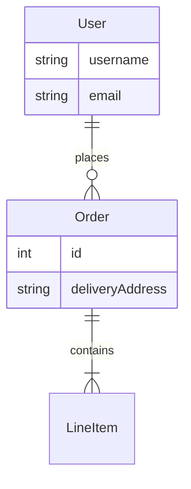

# Schema Design & ERD Guide
## 📌 Project Status (Feb 7, 2026)

Bl1nk Agents Manager is in active development and is not feature‑complete yet.
This repo contains a working extension shell and a Rust core that is being
brought to feature parity with existing TypeScript logic.

**What works now**
- Extension manifest and Gemini CLI scaffolding are present.
- Core Rust modules exist for agents, hooks, MCP/ACP, sessions, and RPC.
- Command and documentation sets are present (currently being refreshed).

**In progress**
- TypeScript → Rust parity for large subsystems (background agents, config,
  ACP normalization).
- End‑to‑end session flows for Gemini/Codex/Qwen within a unified adapter.
- Validation of hook behavior and task orchestration across agents.

**Known gaps**
- Some Rust modules compile but are not fully wired end‑to‑end.
- Configuration loading/migration is still being aligned to actual runtime.
- Authentication flows for some CLIs still require manual steps.

**What to expect right now**
- You can explore the architecture, commands, and agent catalogs.
- Some workflows will still require manual setup or troubleshooting.

For a complete non‑developer overview, see `docs/PROJECT_STATUS.md`.

## 1. Normalization Audit

Review entities for data redundancy and anomalies.

- **1NF (Atomicity):** Ensure columns don't contain lists or complex structures (e.g., comma-separated values).
- **2NF (Partial Dependencies):** In composite keys, non-key attributes must depend on the *whole* key.
- **3NF (Transitive Dependencies):** Non-key attributes should not depend on other non-key attributes.
  - *Anti-pattern:* Storing `zip_code` and `city` in a `User` table.
  - *Fix:* Move `city`/`state` to a `ZipCode` lookup table.

## 2. Constraints & Integrity

- **Not Null:** Prefer `NOT NULL` columns over nullable ones to simplify application logic and avoid NullPointerExceptions.
- **Unique Constraints:** Enforce business uniqueness at the DB level, not just app level.
- **Check Constraints:** Use DB constraints for valid ranges (e.g., `price > 0`) where supported.

## 3. ERD Generation

When asked to "generate an ERD" or "document the schema", produce a **Mermaid** class diagram.

### Format

### Extraction Strategy
1.  Identify all `@Entity` (Java) or `Base` (Python) classes.
2.  Map `@OneToMany`, `@ManyToOne` (Java) or `relationship()` (Python) to lines.
3.  Include key fields (PKs) and significant columns.
