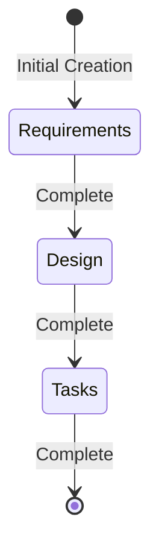
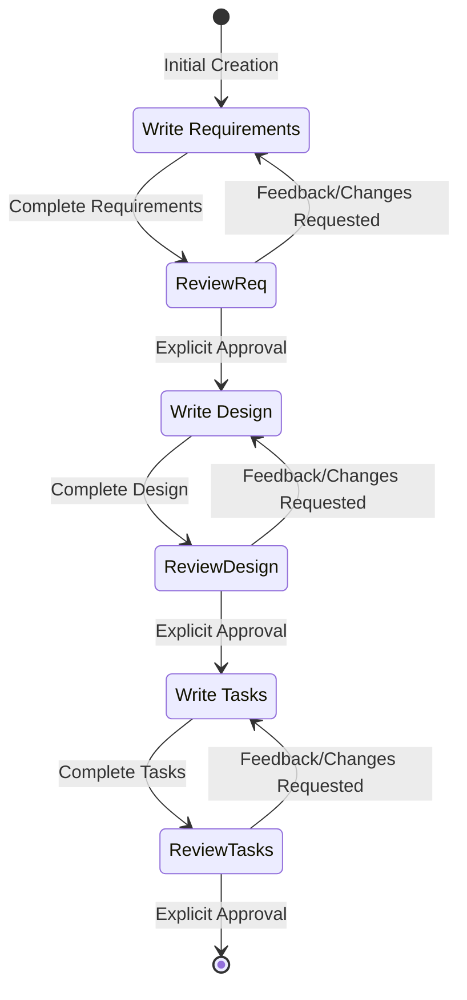
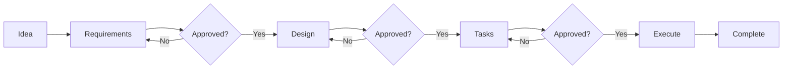
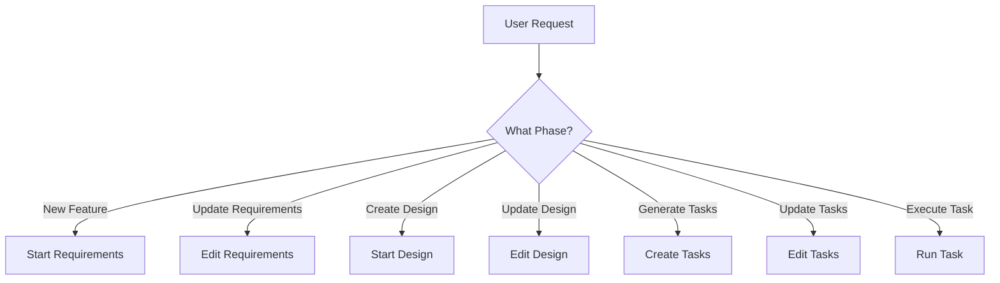
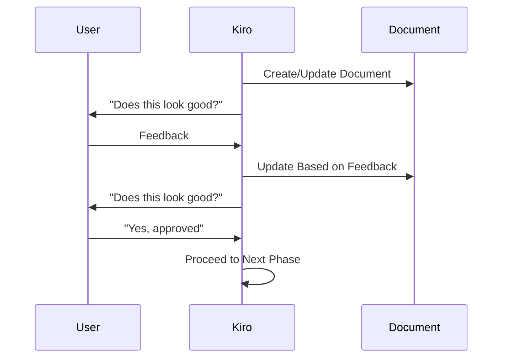
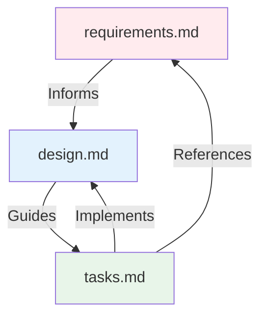
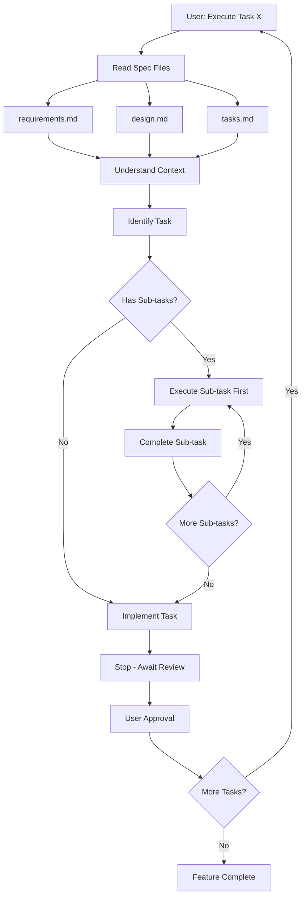
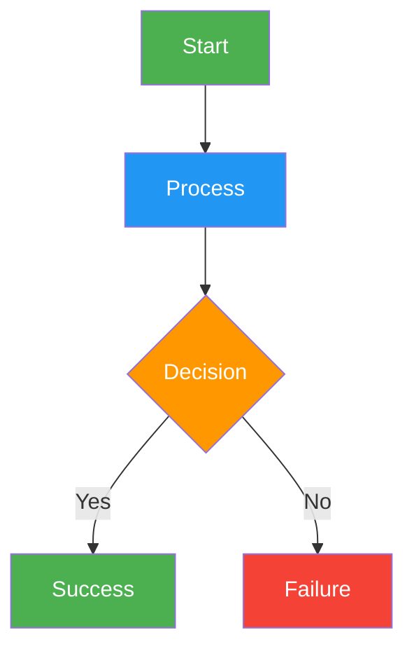

# Kiro Workflow Diagrams

## Overview

Create comprehensive workflow diagrams using Mermaid syntax to visualize software development processes, state machines, and task execution flows.

## Quick Start

Create a basic state diagram:


## Core Workflow Patterns

### 1. State Machine Diagrams

Use for complete workflow visualization with states and transitions:



### 2. Phase Progression Flowcharts

Use for linear phase progression with decision points:



### 3. Entry Point Diagrams

Use for showing multiple workflow entry points:



### 4. Sequence Diagrams

Use for approval gate interactions:



### 5. Document Dependencies

Use for showing relationships between specification files:



## File Structure Templates

### Kiro Specification Structure

```
.kiro/
└── specs/
    └── {feature-name}/    # kebab-case
        ├── requirements.md  # Phase 1
        ├── design.md        # Phase 2
        └── tasks.md         # Phase 3
```

### Diagram Organization

```
docs/
├── workflows/
│   ├── main-workflow.md      # Main state machine
│   ├── phase-progression.md  # Linear progression
│   ├── entry-points.md       # Entry point flows
│   └── task-execution.md     # Task execution flows
├── dependencies/
│   ├── file-structure.md     # Directory structure
│   └── document-deps.md      # Document relationships
└── approvals/
    └── approval-gates.md     # Approval sequences
```

## Task Execution Flow Patterns

### Complex Task Execution



## Styling and Customization

### Color Coding

Use consistent color schemes for different phases:
- **Requirements**: Red/pink tones (`#ffebee`, `#ffcdd2`)
- **Design**: Blue tones (`#e3f2fd`, `#bbdefb`)
- **Tasks**: Green tones (`#e8f5e9`, `#c8e6c9`)
- **Execution**: Purple/gray tones (`#f3e5f5`, `#e0e0e0`)

### Node Styling



## Best Practices

### Diagram Design Principles

1. **Keep it simple** - Avoid overcrowding with too many nodes
2. **Use consistent naming** - Maintain same terminology across diagrams
3. **Color code phases** - Use colors to distinguish workflow phases
4. **Add clear labels** - Label transitions and decision points clearly
5. **Organize hierarchically** - Place related elements together

### Documentation Integration

1. **Link to specs** - Reference actual specification files
2. **Include examples** - Show concrete workflow examples
3. **Maintain consistency** - Use same terminology as codebase
4. **Version control** - Track diagram changes with workflow updates

### Common Patterns

- **Feedback loops** - Show iteration and review cycles
- **Parallel processes** - Use subgraphs for concurrent workflows
- **Entry/exit points** - Clearly mark workflow boundaries
- **Decision gates** - Highlight approval and review points

## Resources

### scripts/
Python scripts for diagram generation and validation:
- `generate_diagrams.py` - Convert markdown to HTML diagrams
- `validate_syntax.py` - Check Mermaid syntax validity
- `export_svg.py` - Export diagrams to SVG format

### references/
- `mermaid_syntax.md` - Complete Mermaid syntax reference
- `workflow_templates.md` - Common workflow pattern templates
- `kiro_process_guide.md` - Detailed Kiro process documentation

### assets/
- `diagram_templates/` - Reusable diagram templates
- `style_themes/` - CSS themes for diagram styling
- `example_workflows/` - Complete workflow examples