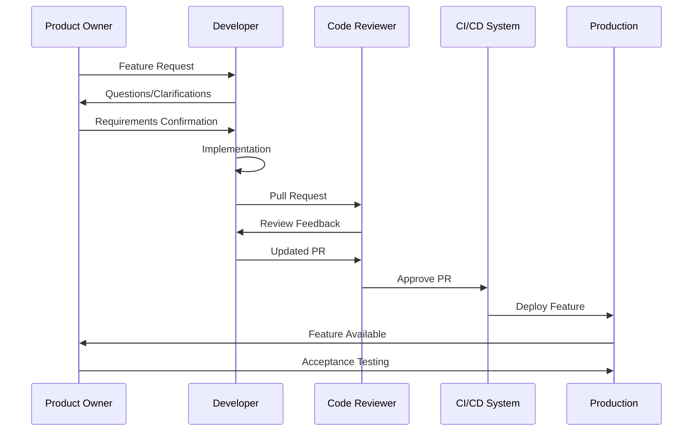
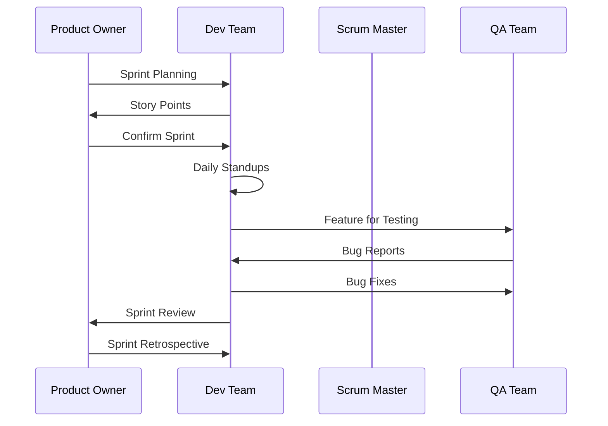
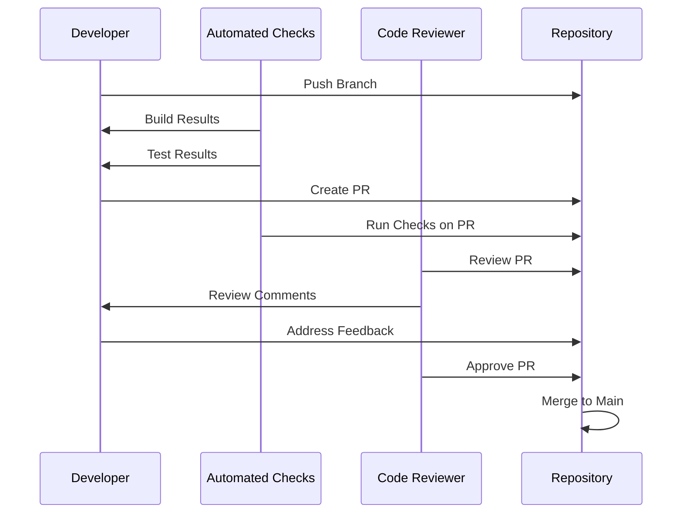
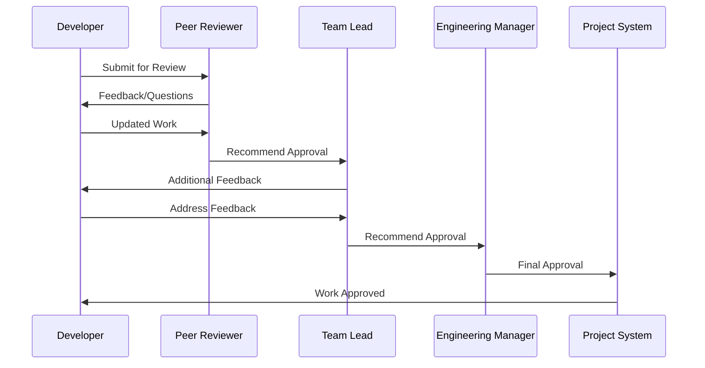
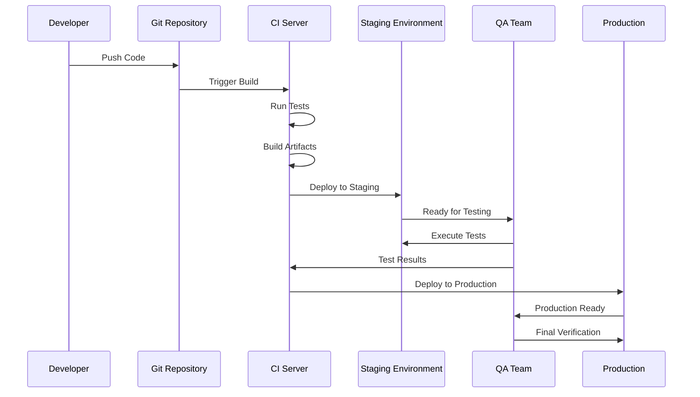
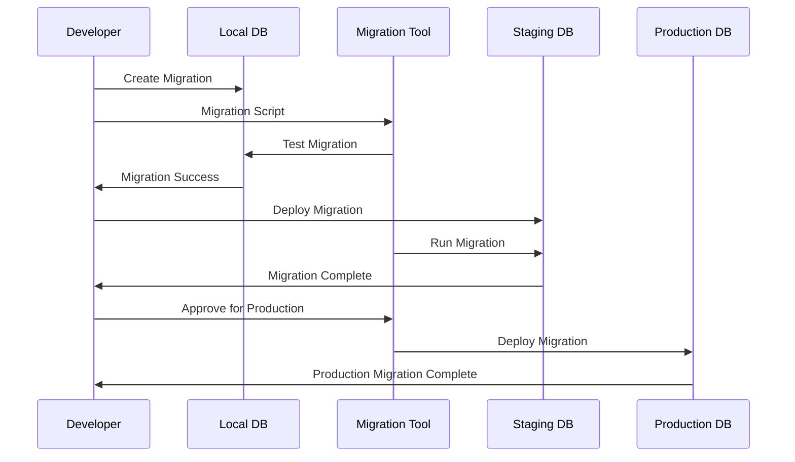
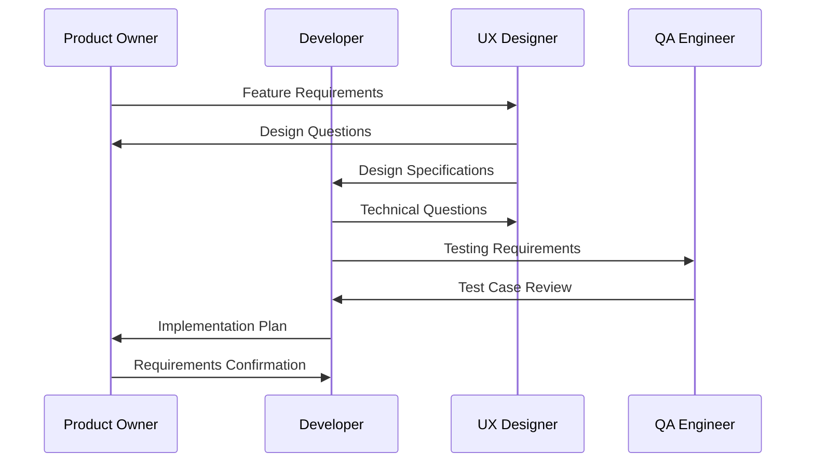
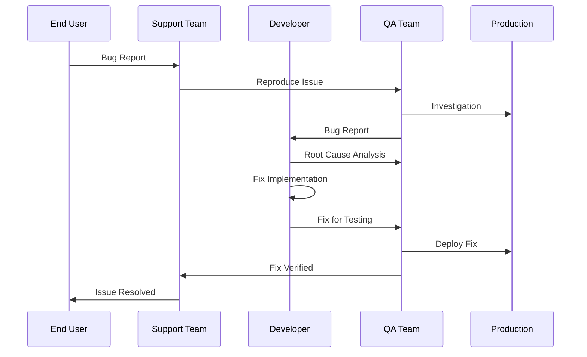

# Kiro Sequence Diagram Templates

## Development Process Sequences

### Standard Development Flow

### Agile Sprint Sequence

## Review and Approval Sequences

### Code Review Process

### Multi-Stage Approval

## Deployment Sequences

### CI/CD Pipeline

### Database Migration

## Communication Sequences

### Requirements Gathering

### Bug Report Handling
