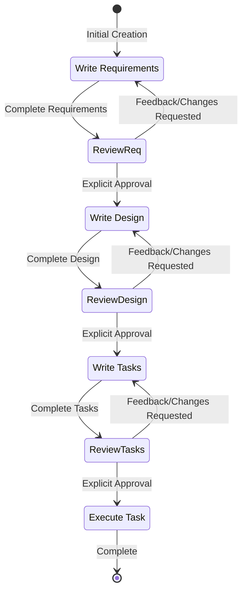
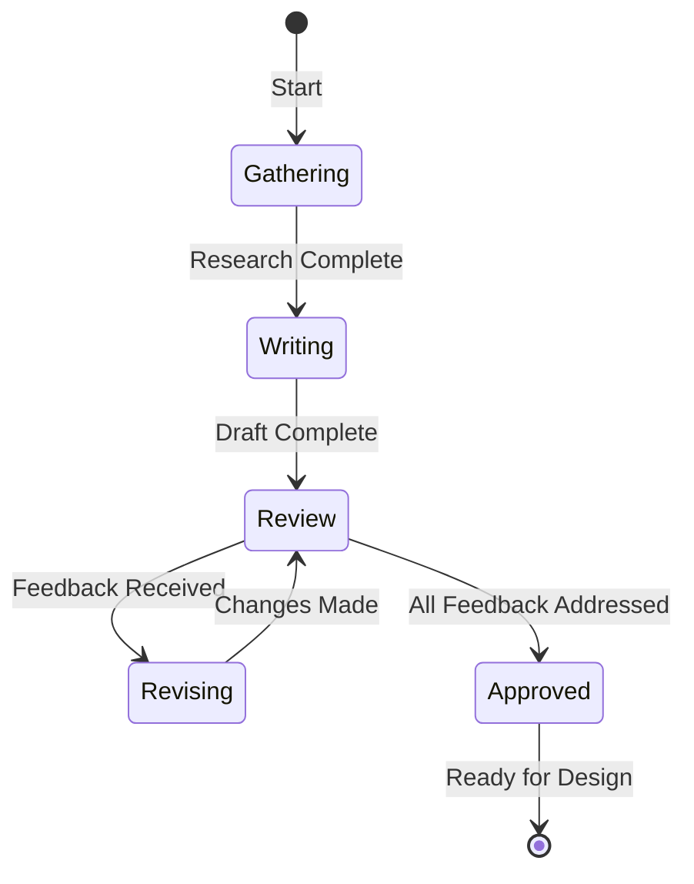
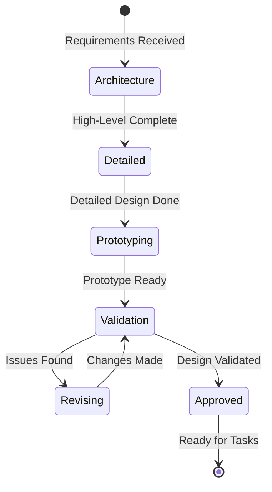
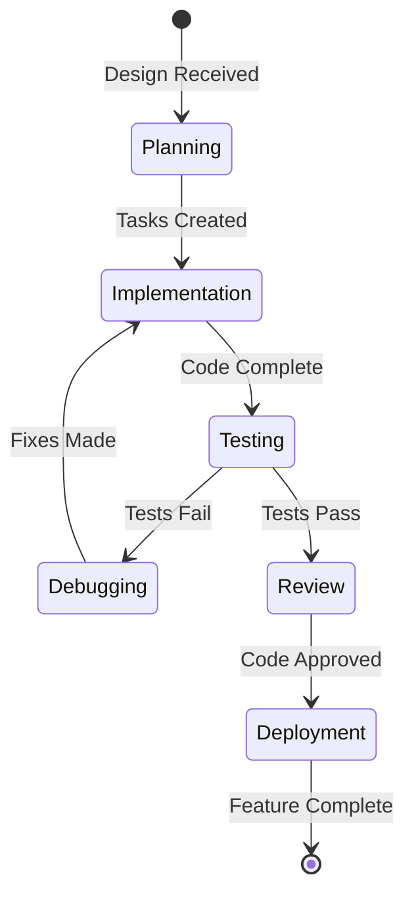
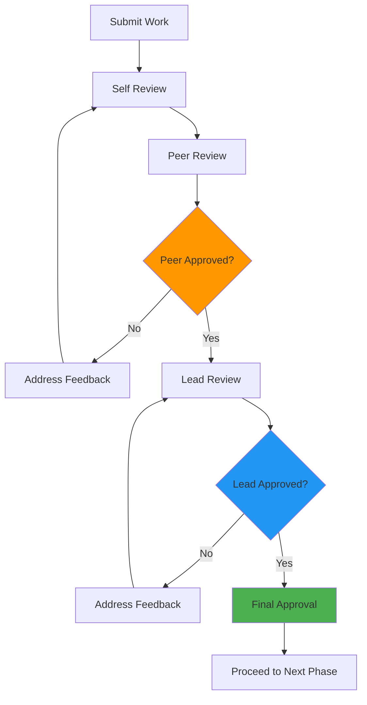
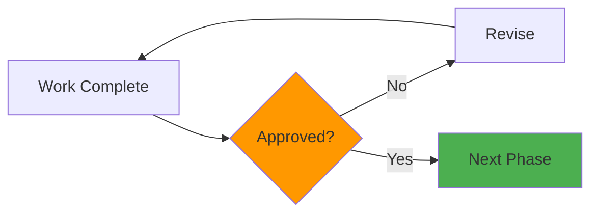

# Kiro Workflow Templates

## Complete Kiro State Machine

### Full Development Lifecycle

## Entry Point Specific Templates

### Requirements Phase

### Design Phase

### Task Execution

## Approval Gate Templates

### Multi-Stage Approval

### Simple Approval
