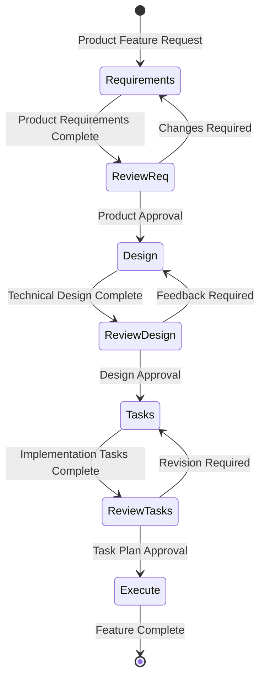
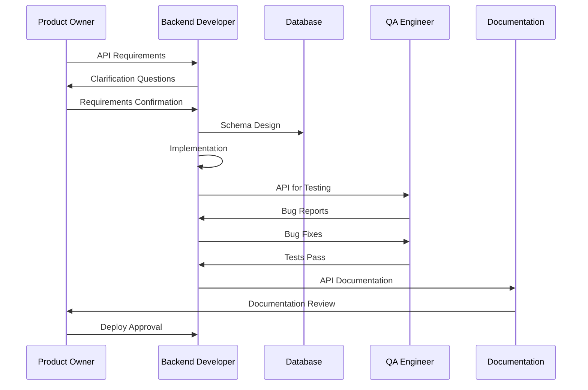
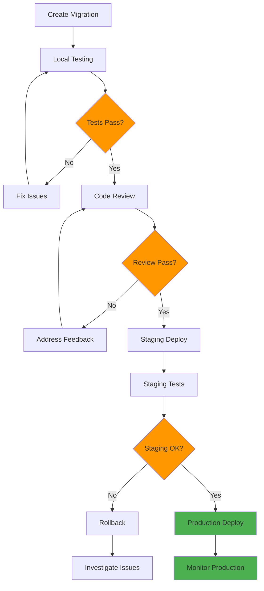
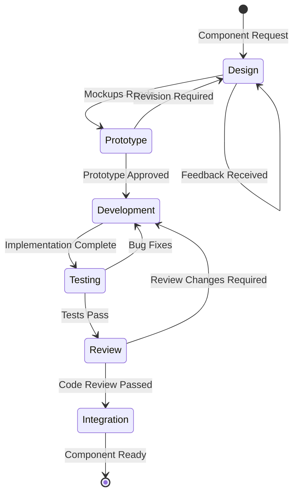
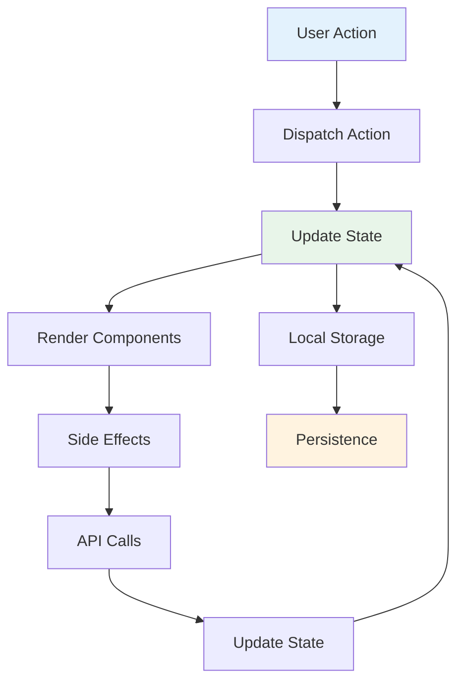
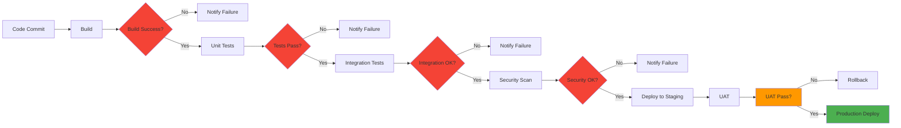
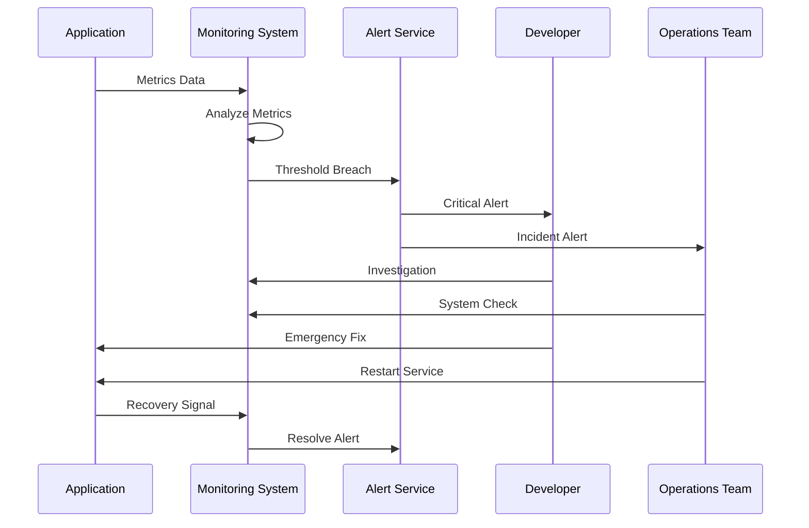

# Kiro Workflow Examples

## Complete Feature Development

### E-commerce Feature Addition


### User Authentication System
```mermaid
graph TD
    A[User Login Request] --> B{Credentials Valid?}
    B -->|Yes| C[Generate Token]
    B -->|No| D[Show Error]
    C --> E[Return Success]
    D --> F[Log Attempt]
    E --> G[Update Last Login]
    F --> H[Lock Account?}
    H -->|Yes| I[Security Lock]
    H -->|No| J[Allow Retry]
    
    style B fill:#ff9800
    style C fill:#4caf50
    style E fill:#4caf50
    style D fill:#f44336
    style I fill:#f44336
```

## API Development Workflow

### REST API Creation


### Database Migration Process


## Frontend Development Workflows

### Component Development


### State Management Flow


## DevOps and Deployment

### CI/CD Pipeline


### Monitoring and Alerting
