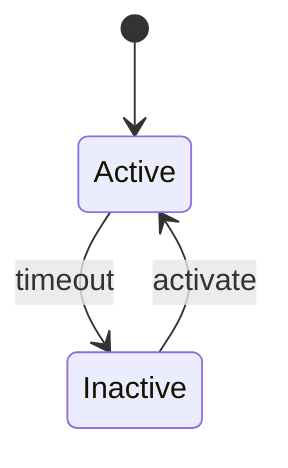
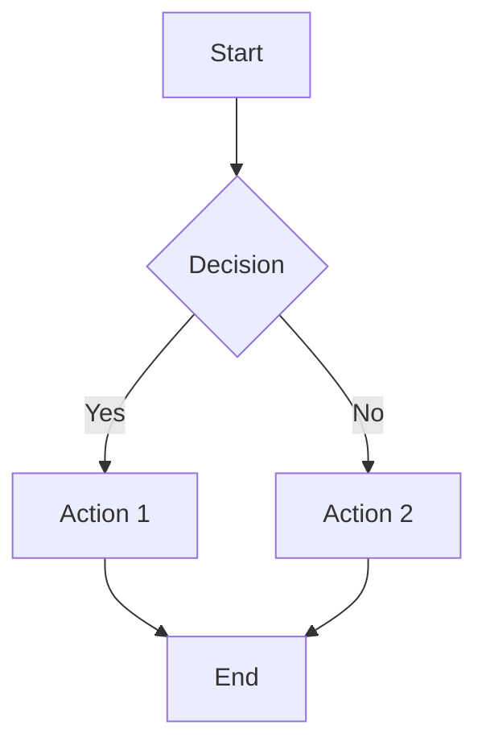
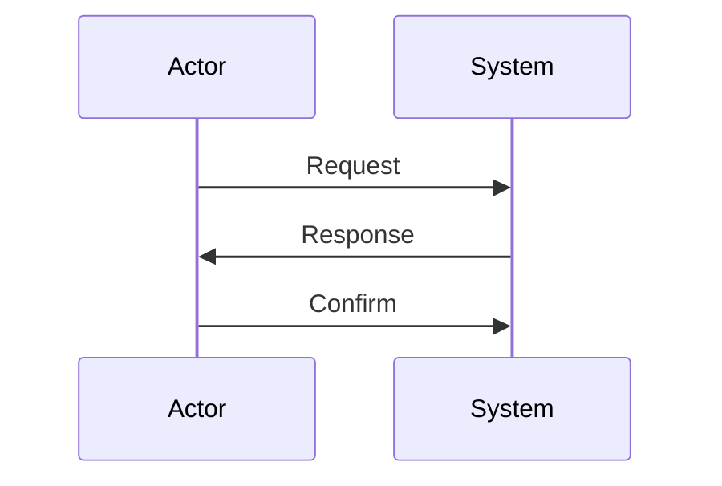
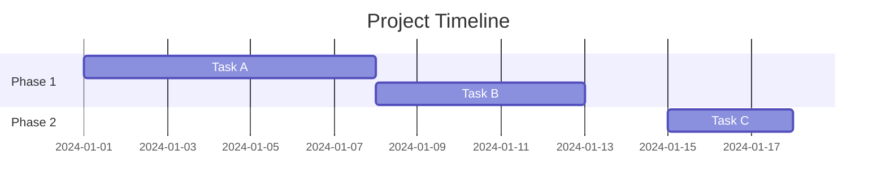
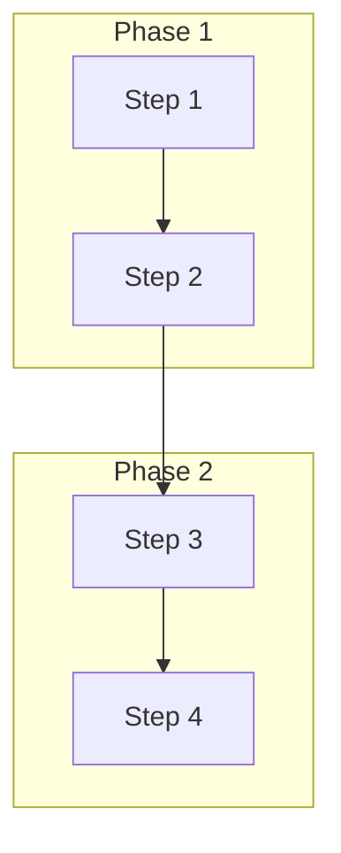
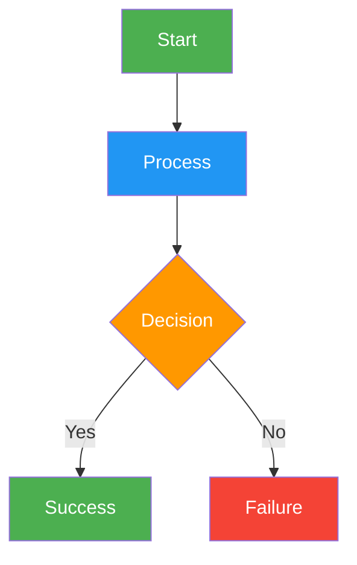
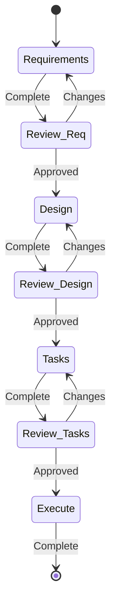
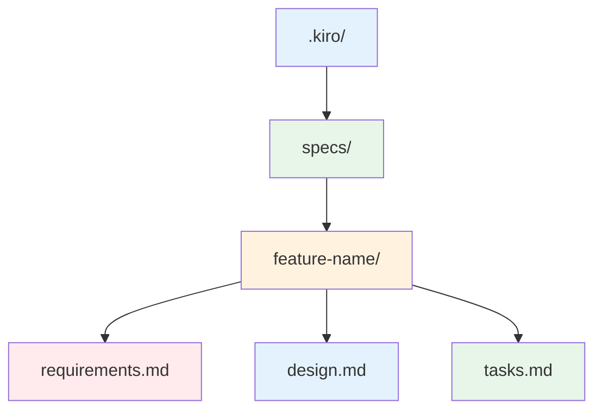

# Mermaid Syntax Reference
## 📌 Project Status (Feb 7, 2026)

Bl1nk Agents Manager is in active development and is not feature‑complete yet.
This repo contains a working extension shell and a Rust core that is being
brought to feature parity with existing TypeScript logic.

**What works now**
- Extension manifest and Gemini CLI scaffolding are present.
- Core Rust modules exist for agents, hooks, MCP/ACP, sessions, and RPC.
- Command and documentation sets are present (currently being refreshed).

**In progress**
- TypeScript → Rust parity for large subsystems (background agents, config,
  ACP normalization).
- End‑to‑end session flows for Gemini/Codex/Qwen within a unified adapter.
- Validation of hook behavior and task orchestration across agents.

**Known gaps**
- Some Rust modules compile but are not fully wired end‑to‑end.
- Configuration loading/migration is still being aligned to actual runtime.
- Authentication flows for some CLIs still require manual steps.

**What to expect right now**
- You can explore the architecture, commands, and agent catalogs.
- Some workflows will still require manual setup or troubleshooting.

For a complete non‑developer overview, see `docs/PROJECT_STATUS.md`.

## Core Diagram Types

### 1. State Diagrams

**Purpose**: Show system states and transitions



**Key Elements**:
- `[*]` - Start/end state
- `StateName` - State declaration
- `StateA --> StateB : label` - Transition with label
- `StateA --> StateB : event` - Event trigger

### 2. Flowcharts

**Purpose**: Show process flows and decision logic



**Graph Directions**:
- `TD` - Top to Down (default)
- `LR` - Left to Right
- `BT` - Bottom to Top
- `RL` - Right to Left

**Node Shapes**:
- `A[Text]` - Rectangle
- `A(Text)` - Rounded rectangle
- `A{Text}` - Diamond
- `A((Text))` - Circle

### 3. Sequence Diagrams

**Purpose**: Show interaction between components over time



**Arrow Types**:
- `->` - Solid arrow
- `-->` - Dashed arrow
- `->>` - Open arrow
- `-->>` - Open dashed arrow

### 4. Gantt Charts

**Purpose**: Show project timeline and dependencies



## Advanced Features

### Subgraphs



### Styling



### Comments and Notes

```mermaid
%% This is a comment
graph TD
    A[Start] --> B[End] %% Inline comment
```

## Kiro Workflow Specific Patterns

### State Machine for Development Phases



### File Structure Visualization



## Common Syntax Rules

1. **Node IDs**: Use spaces or underscores, avoid special characters
2. **Labels**: Use quotes for labels with spaces: `--> B : "Label with spaces"`
3. **Escape Characters**: Use `#9829;` for special characters
4. **Line Breaks**: Use `<br/>` for text line breaks
5. **HTML**: Basic HTML supported in node text

## Integration Tips

- Use consistent naming across diagrams
- Apply color schemes systematically
- Keep diagrams readable (avoid overcrowding)
- Test syntax with validator script
- Export multiple formats for different use cases
