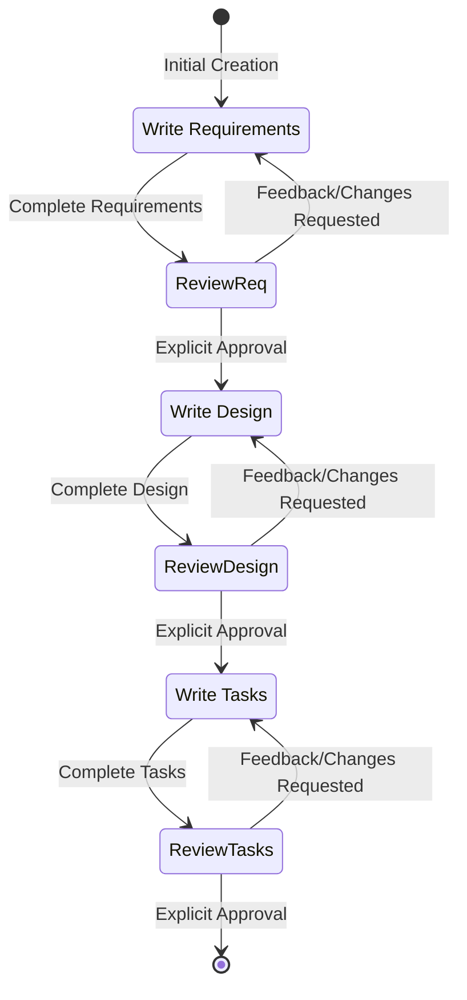
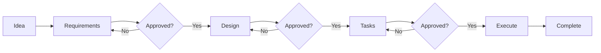
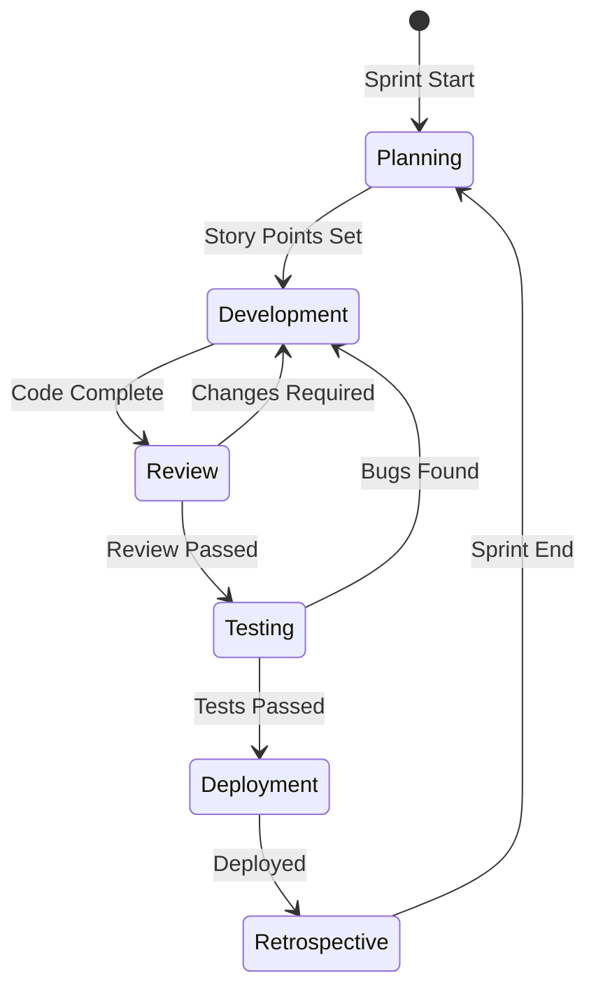
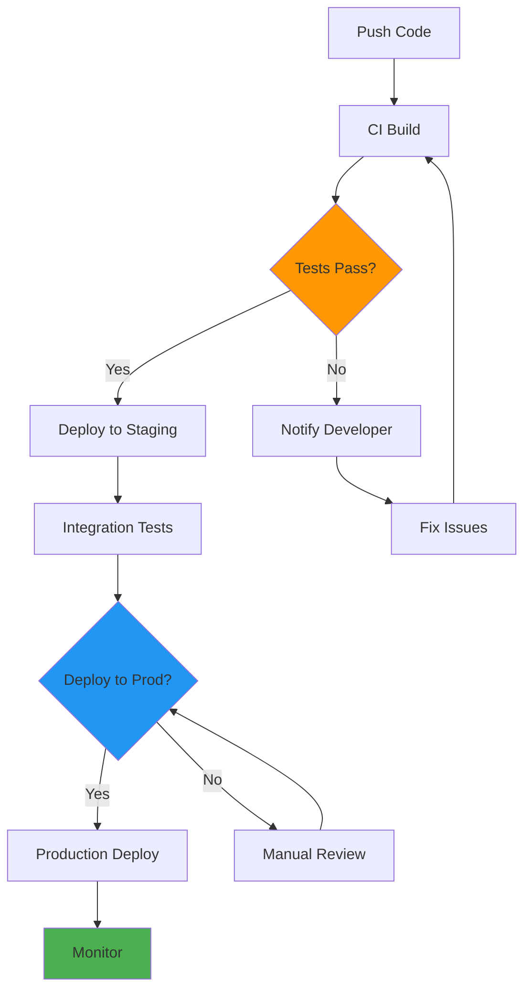
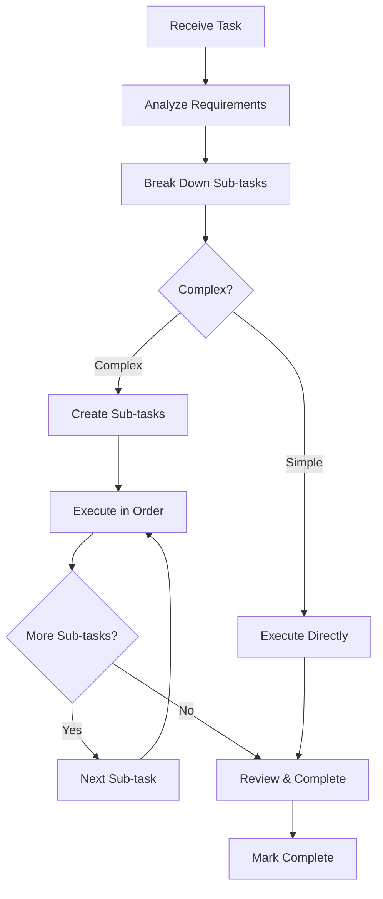
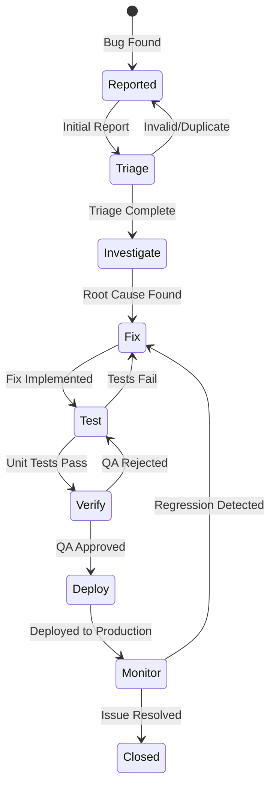
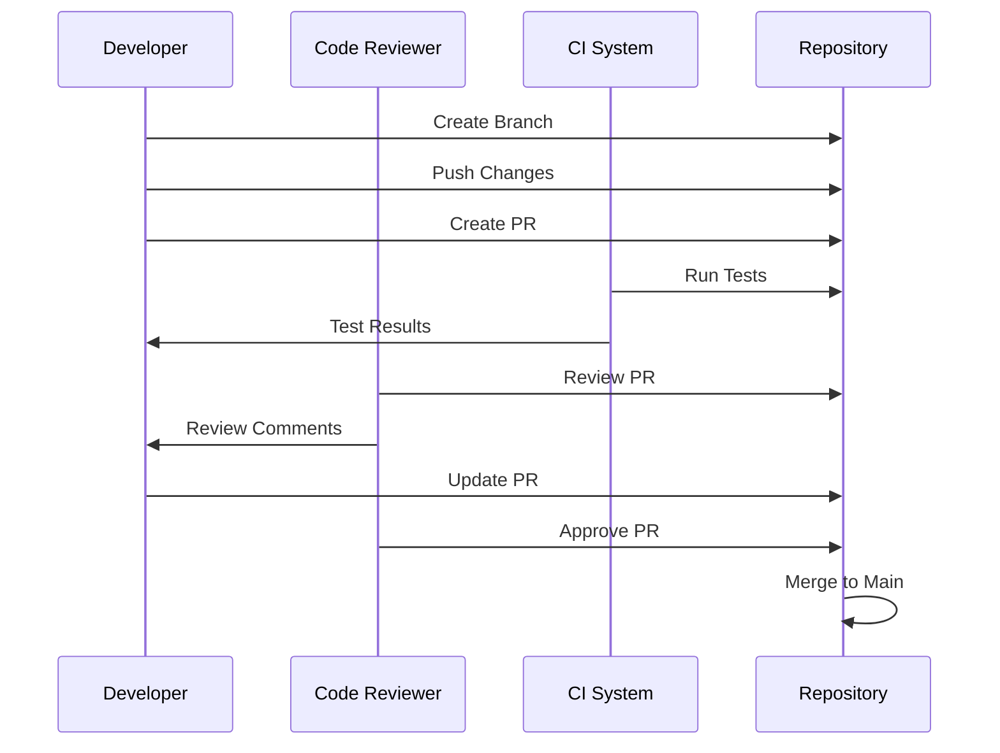
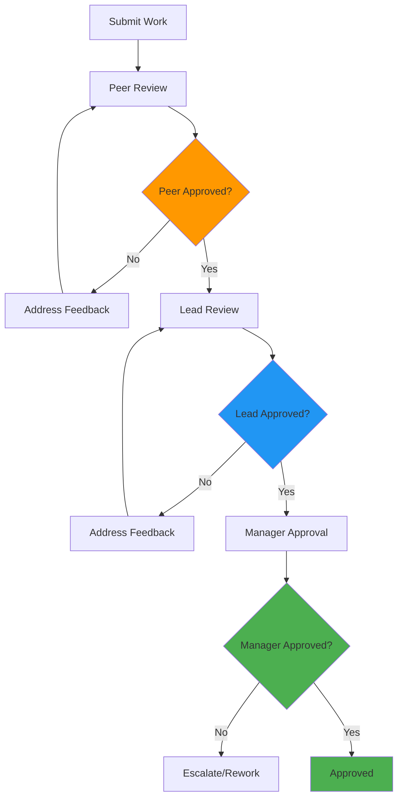
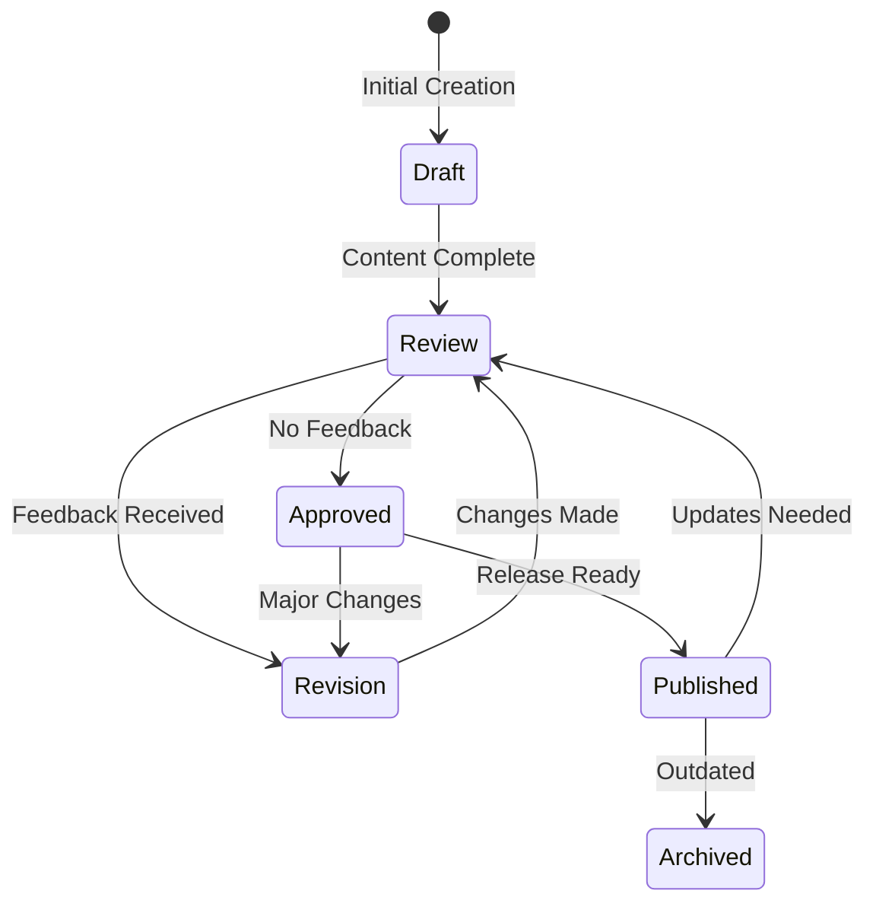
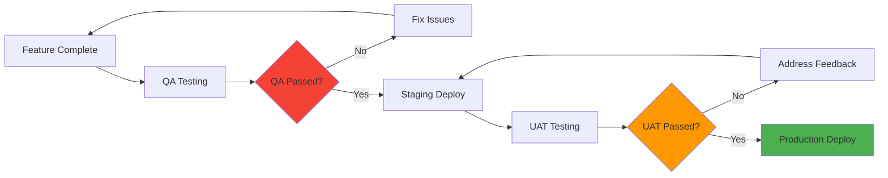

# Common Workflow Templates
## 📌 Project Status (Feb 7, 2026)

Bl1nk Agents Manager is in active development and is not feature‑complete yet.
This repo contains a working extension shell and a Rust core that is being
brought to feature parity with existing TypeScript logic.

**What works now**
- Extension manifest and Gemini CLI scaffolding are present.
- Core Rust modules exist for agents, hooks, MCP/ACP, sessions, and RPC.
- Command and documentation sets are present (currently being refreshed).

**In progress**
- TypeScript → Rust parity for large subsystems (background agents, config,
  ACP normalization).
- End‑to‑end session flows for Gemini/Codex/Qwen within a unified adapter.
- Validation of hook behavior and task orchestration across agents.

**Known gaps**
- Some Rust modules compile but are not fully wired end‑to‑end.
- Configuration loading/migration is still being aligned to actual runtime.
- Authentication flows for some CLIs still require manual steps.

**What to expect right now**
- You can explore the architecture, commands, and agent catalogs.
- Some workflows will still require manual setup or troubleshooting.

For a complete non‑developer overview, see `docs/PROJECT_STATUS.md`.

## Kiro Development Workflow

### Basic State Machine

### Phase Progression

## Software Development Workflows

### Agile Sprint Workflow

### CI/CD Pipeline

## Task Management Workflows

### Task Execution Flow

### Bug Fix Workflow

## Code Review Workflows

### Pull Request Process

## Approval Gate Patterns

### Multi-level Approval

## Documentation Workflows

### Document Lifecycle

## Release Management

### Feature Release Pipeline

## Usage Instructions

1. **Select Template**: Choose the template closest to your workflow
2. **Customize**: Modify nodes, transitions, and labels
3. **Apply Styling**: Add colors and themes for clarity
4. **Validate**: Use syntax validator to check correctness
5. **Export**: Generate HTML or SVG for sharing

## Customization Tips

- **Rename nodes** to match your specific terms
- **Adjust transitions** for your process steps
- **Add decision points** where choices occur
- **Include feedback loops** for iterative processes
- **Apply consistent colors** for phase identification
